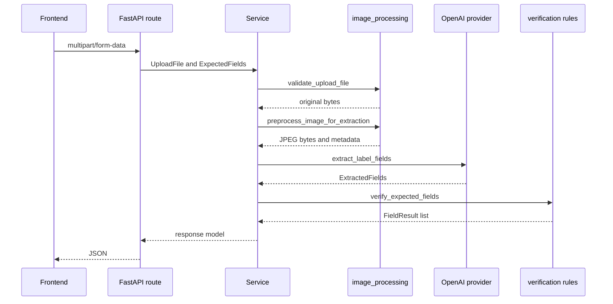

# Backend Architecture

## Purpose

The backend is a FastAPI service that validates uploads, preprocesses images, delegates visible-text extraction to the OpenAI provider boundary, applies deterministic verification rules, and returns structured responses.

## Entrypoint

- Application factory: `create_app` in `backend/app/main.py`
- ASGI app: `app` in `backend/app/main.py`
- Local startup target: `app.main:app`
- Render startup command: `uvicorn app.main:app --host 0.0.0.0 --port $PORT`

## Route Registration

`create_app()` configures logging, reads settings, creates the FastAPI app, adds CORS middleware, registers routers, and installs a generic exception handler.

Routers:

- `backend/app/routes/health.py`
- `backend/app/routes/warmup.py`
- `backend/app/routes/verification.py`

## Module Boundaries

- `backend/app/routes`: HTTP input parsing, response models, and HTTP error mapping.
- `backend/app/services`: workflow orchestration for single-label, batch, timing, and warmup flows.
- `backend/app/image_processing`: upload validation and in-memory image preprocessing.
- `backend/app/providers/openai`: OpenAI client reuse, extraction request execution, response parsing, provider error mapping, and extraction concurrency.
- `backend/app/verification`: deterministic field comparisons and field result construction.
- `backend/app/utils`: generic logging and text normalization helpers.
- `backend/app/config.py`: all backend environment configuration.

## Request Lifecycle

## Error Boundary

Known user-fixable and provider failures are mapped in `backend/app/routes/verification.py`. Unexpected exceptions are handled by `handle_unexpected_error` in `backend/app/main.py`, logged by class name only, and returned as safe JSON.

## Security Notes

- The provider key is backend-only.
- Uploaded image bytes are not logged.
- Uploaded files are not persisted.
- CORS origins come from `ALLOWED_ORIGINS`.
- Configuration values are read centrally in `backend/app/config.py`.
