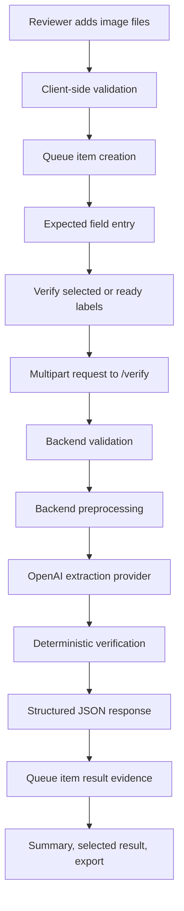

# Data Flow

## Main Flow

## Upload Flow

Frontend:

- `ImageUploadDropzone` collects files from file or folder inputs.
- `planQueueFileAddition` filters invalid files, duplicate basenames, and files over the queue limit.
- `createQueueItem` creates in-memory queue items with empty expected fields.
- Queue item files remain browser `File` objects until verification.

Backend:

- `validate_upload_metadata` checks filename, extension, and MIME type.
- `validate_file_size` checks empty and oversized files.
- `validate_image_can_open` verifies decoded image content, extension/content-type consistency, and pixel count.

## Image Preprocessing Flow

`preprocess_image_for_extraction`:

1. Opens uploaded bytes with Pillow.
2. Applies EXIF orientation.
3. Converts to RGB.
4. Resizes only when width exceeds `MAX_IMAGE_WIDTH`.
5. Saves an optimized JPEG using `JPEG_QUALITY`.
6. Returns bytes, dimensions, and byte count.

## Extraction Flow

`extract_label_fields`:

- Reads active settings through `get_settings()` when settings are not injected.
- Uses a per-event-loop semaphore capped by `OPENAI_EXTRACTION_CONCURRENCY`.
- Runs the synchronous provider call in a worker thread.
- Parses provider output into `ExtractedFields`.

## Verification Flow

`verify_expected_fields`:

- Always verifies brand name.
- Verifies class/type, alcohol content, and net contents only when corresponding expected values are not blank.
- Always verifies the backend standard government warning text.
- Returns one `FieldResult` per checked field.

`calculate_overall_status` derives the response status from field statuses:

- `error` if any field status is `error`
- `fail` if any field status is `fail`
- `needs_review` if any field status is `missing`, `needs_review`, or `normalized_match`
- `pass` otherwise

## Queue And Batch Flow

Frontend queue:

- Calls `/verify` once per selected label or once per ready label.
- Uses `VERIFY_ALL_CONCURRENCY = 2` for ready-label verification.
- Stores each response on its queue item.

Backend batch endpoint:

- `/verify-batch` accepts a list field named `files`.
- It requires at least 2 files and at most `MAX_BATCH_SIZE`.
- It rejects duplicate basenames case-insensitively before processing.
- It uses `BATCH_CONCURRENCY` to limit concurrent per-file work.
- It returns per-file errors inside the batch response.

## Export Flow

CSV and Excel exports are built in the browser from current queue state by `frontend/src/utils/resultExport.js`. Only current verification results are exported; unverified and stale items are skipped.
