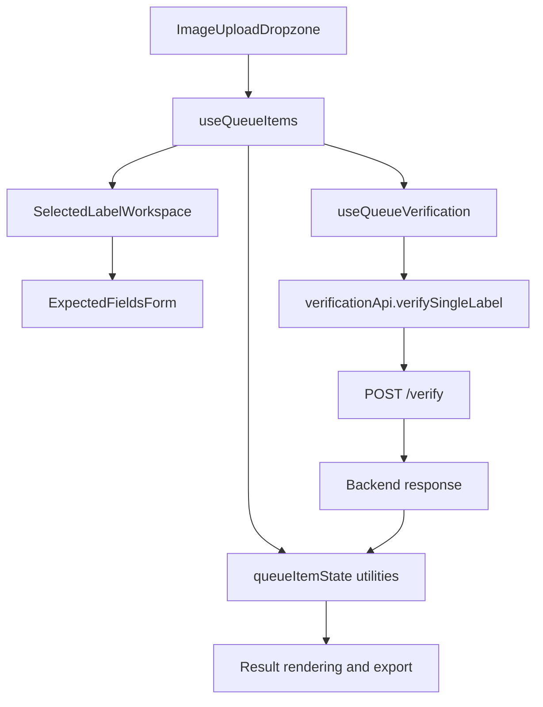

# Frontend Architecture

## Purpose

The frontend is a React 18 application built with Vite. It owns the browser workflow for uploading label images, editing expected application data, managing queue state, calling backend verification endpoints, rendering results, and exporting verified rows.

## Entrypoints

- `frontend/index.html`: Vite HTML shell with `#root`.
- `frontend/src/main.jsx`: React root creation, `StrictMode`, global style imports.
- `frontend/src/App.jsx`: application shell, health check, top-level error banner, header, verification workflow, footer.

There is no React Router configuration. The app is a single-screen workflow.

## Component Organization

- `frontend/src/components/shared`: shell, feedback, tooltip, and loading components.
- `frontend/src/components/upload`: file and folder upload dropzone.
- `frontend/src/components/queue`: queue list, item cards, filters, summary, and action controls.
- `frontend/src/components/verification`: selected-label workspace, expected fields, selected result detail, field cards, extracted text, and workflow composition.
- `frontend/src/components/dialogs`: copy-data, preview, and export dialogs.

## State Management

State is local React state coordinated by custom hooks:

- `useQueueItems` owns queue items, selected item id, filters, copy modal state, preview state, and queue-level handlers.
- `useQueueVerification` owns verification locking, selected-label verification, and ready-label concurrent verification.
- `useQueueRemovalAnimation` tracks delayed removal state.
- `useQueueItemPreview` tracks which queue item is previewed.

There is no Redux, external store, or persisted browser storage.

## Frontend Data Flow

## API Boundary

`frontend/src/api/verificationApi.js` is the only endpoint-aware frontend module. It reads `VITE_API_BASE_URL`, builds multipart form payloads, parses JSON responses, and throws user-facing `Error` objects for non-OK responses.

The frontend currently calls:

- `GET /health`
- `POST /warmup`
- `POST /verify`

The frontend does not call `POST /verify-batch`.

## Upload And Queue Behavior

- File input accept list is defined in `frontend/src/utils/fileValidation.js`.
- Supported frontend file types are JPG/JPEG, PNG, WebP, and TIFF/TIF.
- Client-side queue limit is 10 active labels.
- Duplicate detection uses canonical basenames and is case-insensitive.
- Folder paths are used only for duplicate detection and are not shown in queue labels.
- The first successful queue addition triggers one best-effort backend warmup call.

## Export Behavior

`frontend/src/utils/resultExport.js` builds CSV and Excel exports from current, non-stale verification results only. Exports include status columns and processing time, but not raw extracted text.

## Styling

Global styles are imported in `frontend/src/main.jsx`:

- `frontend/src/styles/index.css`
- `frontend/src/styles/components.css`

`components.css` imports component partials under `frontend/src/styles/components/`.
